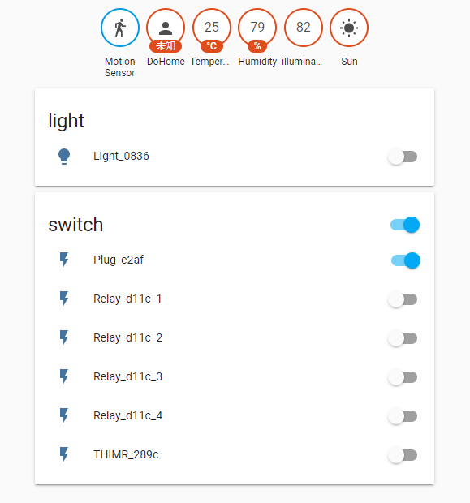
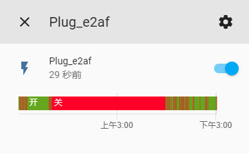
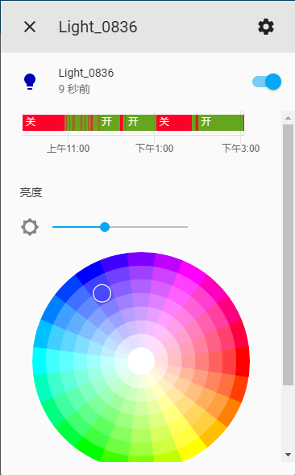
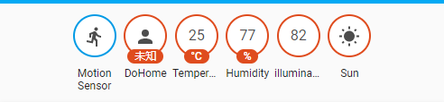

# DoHome_HomeAssistant_Components
[中文版本](./README.md)    

Have the HomeAssistant support the Components for the DoHome device     

* LAN auto discovery
* Support devices：Plug、RGB colored lights、temperature and humidity、 human body detection、 temperature and humidity + light + human body + temperature and humidity + relay、 two-way relay、 four-way relay

 


## Plug、Two-way relay、 Four-way relay
* Support LAN control and device status feedback    
 

## Color Light
* Support full color RGB and brightness adjustment        
 

## Sensor
* Support temperature and humidity, light, human detection     
 

## Directions for use
### 1、Add the components
Place the custom_components directory file in the HomeAssistant configuration directory /config/custom_components

### 2、Modify the configuration file
Edit the HomeAssistant configuration file configuration.yaml and add the following code
```
dohome:
  discovery_ip: '192.168.9.255'    #Used to discover the broadcast IP of the device, this parameter may be omitted
  discovery_retry: 3                    #The number of attempts found on the Intranet, this parameter may be omitted
```
#### Configuration instructions
1. If you install HomeAssistant under Linux or Windows use Python, you can leave out the discovery_ip parameter. You can just add `dohome:`
2. If you use Docker to install HomeAssistant, you need to add discovery_ip parameter when using this plug-in, IP is the broadcast IP of the routing gateway IP of the connection, and when your local IP is 192.168.9.17, just change the last bit to 255.configuration is `discovery_ip: '192.168.9.255'`
3. The Intranet discovery was scanned when the plug-in was loaded. It can be considered that HA was scanned at startup, and the scan time was discovery_retry*5 seconds. A long scan will affect HA startup, and the default time is 2 times

## Note
* Docker installation HomeAssistant needs to map port 6091, using UDP protocol

