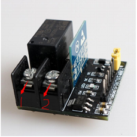
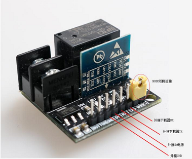

## 1.Appearance

  
  
|参数                   |数值                                         |
|-----------------------|-------------------------------------------|
|product name：               | HomeKit remote control relay switch                 |
|Product size：                  |L：30mm W：30mm H：15mm                       |
|Weight：              |13.5g                                  |
|Control circuit voltage：           |5V                                      |
|Control circuit current ：：           |150mA                                     |
|Relay output DC voltage ：           |30V                                      |
|Relay output DC current ：             |5A                                      |
|Relay output AC voltage ：             |250V                                      |
|Relay output AC current ：                  |10A                                       |

## 2. Hardware interface description

1.Pin definition There are eight external control pins (as shown in the figure below), which are 1. Download pin (mode), 2. Download pin (mode), 3. Rx, 4. TX, 5. 5V, 6. GND, 7. Button, 8. Button.

  
  
2.Introduction to relay interface The relay controls the two external interface interfaces 1 and 2, when the relay is on conductance Interface 1 and interface 2 are in the closed state. When the relay is powered off, the two interfaces are disconnected.

  
  
3.How to use: 3.1Button control When it is necessary to use the external button to control the operation of the relay, it is only necessary to connect the 5,6 pin external 5V power supply and GND, and the button control function can be realized by shorting the 7,8 button pin.

3.2How to enter download mode When it is necessary to download the firmware of the development board, you can enter the download mode by shorting the 1 and 2 mode pins with the shorting cap, and then connect the 5V power supply pins, GND pins, RX and TX pins respectively with the download tool.

  
