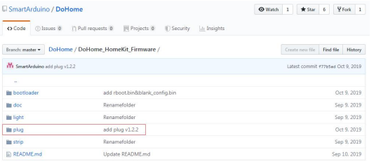

The download tools can download from:
[address](https://github.com/SmartArduino/DoHome/tree/master/DoHome_HomeKit_Firmware)

If you want to restore the factory firmware, please refer to the following steps. If you download third-party firmware, refer to the following steps.

Step 1: enter the above download address and select the download tool on the interface, download it to the local, and extract it.

Step 2: select the plug folder on the interface, click enter to download the latest version of the development board firmware to the local. Select the bootloader folder on the interface and click enter to download the boot firmware of the development board to the local.

   
   
Step 3: after the firmware and tools are downloaded to the local area,
double-click to open the flash download tools tool, select the type of development board download tool as esp8285 download tool, open the tool, select the relevant firmware, and the download address of the firmware is as shown in the right figure (Note: only one of them needs to be downloaded for U1 and U2, and the address cannot be interchanged)

  

Step 4: after connecting the development board to the PC, select the appropriate serial port, fill in the correct firmware and download address, and then use the shorting cap to short connect the 1 and 2 mode pins to enter the download mode. Then use the download tool to connect the 5V power pin, GND pin, RX pin and TX pin respectively. Click the start button to complete the download, as shown in the figure on the right below is the rendering of the successful download.

   
