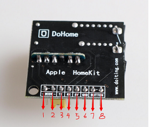

## 1. 产品参数及外观

 

|参数                   |数值                                         |
|-----------------------|-------------------------------------------|
|产品名称：               | HomeKit 远程遥控继电器开关                 |
|尺寸：                  |长：30mm 宽：30mm 高：15mm                       |
|产品重量：              |13.5g                                  |
|控制电路电压：           |5V                                      |
|控制电路电流：           |150mA                                     |
|继电器输出直流电压：           |30V                                      |
|继电器输出直流电流：             |5A                                      |
|继电器输出交流电压：             |250V                                      |
|继电器输出交流电流：                  |10A                                       |

## 2. 硬件接口说明

1. 引脚定义： 共有八个可外接的控制引脚(如下图)，从左到右分别为 1.下载引脚 (MODE)，2.下载引脚(MODE)，3.数据接收引脚(RX)，4.数据发送引脚(TX)， 5.电源引脚(5V)，6.接地引脚(GND)，7.按钮引脚(BUTTON)，8.按钮引 脚(BUTTON)。

 
 
 2. 继电器接口介绍 继电器控制着两个外接接口接口 1 和接口 2，当继电器通电导通时 接口 1 和接口 2 处于闭合状态，当继电器断电时，两个接口断开。
 
  
  
  3. 接口使用： 3.1 按钮控制： 当需要使用外接按钮控制继电器工作时只需要将 5,6 引脚外接 5v 电 源和 GND，在将 7,8 的 BUTTON 引脚短接即可实现按钮控制功能。 3.2 如何进入下载模式： 当需要对开发板进行固件下载时，只需要使用短接帽将 1,2 MODE 引 脚短接，就可以进入下载模式，之后使用下载工具将 5V 电源引脚，GND 引脚，RX，TX 引脚分别相连接即可。
  
  
