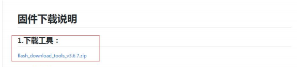
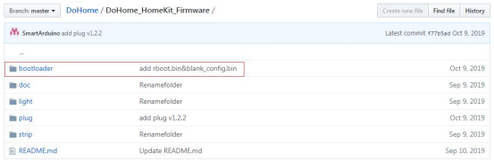
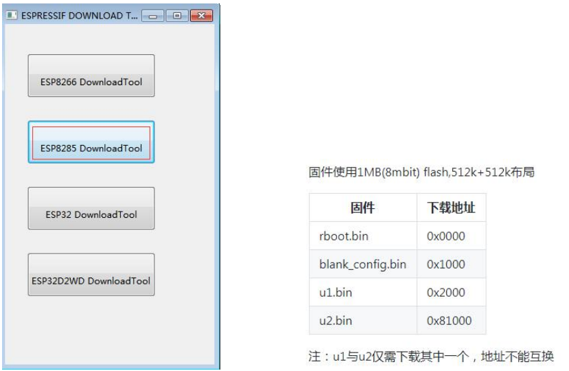
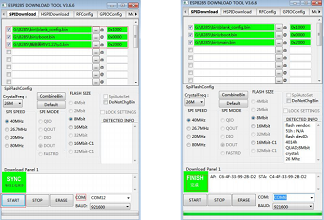

工具及其固件的下载地址为：

https://github.com/SmartArduino/DoHome/tree/master/DoHome_Hom eKit_Firmware

第一步：进入上面的下载地址然后选中界面上的下载工具，将其进行 下载到本地，解压。

 
 
第二步：选中界面上的 plug 文件夹，点击进入，将其中最新版的开 发板固件下载到本地。

 
 
第三步：选中界面上的 bootloader 文件夹，点击进入，将其中的开发 板引导固件下载到本地。

 
 
第四步：固件和工具下载到本地后，双击打开 flash_download_tools 工具，选择开发板下载工具类型为 ESP8285 Download Tool，打开该工
具后，选中相关相关固件，固件的下载地址如下右图(注：u1 与 u2 仅需下载其中一个，地址不能互换)

 
 
第五步：将开发板与 PC 机连接好后，选择合适的串口，填写正确的 固件及其下载地址后，点击 START 按钮即可完成下载，如下右图为下 载成功效果图。

  
