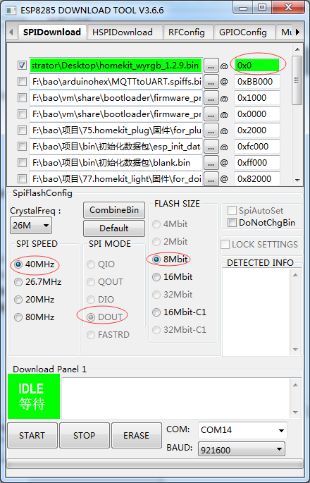

## 1. How To Write Firmware（windows）
1. Installation[Serial Port Driver](https://github.com/SmartArduino/DoHome/blob/master/DoHome_HomeKit_Moon_Light/Drive/ch341ser.7z)
2. Installation[Programming Tool](http://espressif.com/en/support/download/other-tools)
3. Burn the relevant bin file
After selecting the appropriate serial port, configure the serial port number, serial port baud rate, 
etc. as shown below, and press START to start downloading the program.

    
