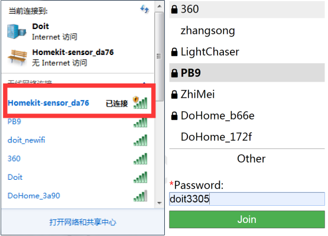
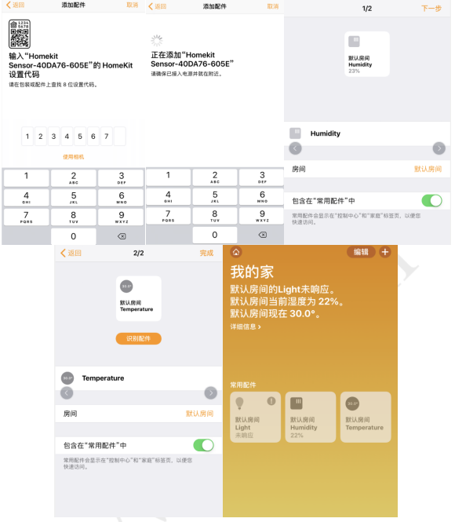

## Step 1: Configure device networking
When the device is powered on, open a hotspot of Homekit-sensor_xxxx and connect the hotspot of "Homekit-sensor_xxxx" with 
the password of none, and wait about 3 seconds. The mobile phone will automatically jump to the distribution network interface. 
Note: If there are multiple devices, please pay attention to distinguishing different hotspot names.
If the mobile phone does not automatically jump to the distribution network interface, please open the mobile browser 
input: http://192.168.4.1, waiting to enter the distribution network interface. Please select your family WiFi name in the jump
page, and enter your password in the password, and click join.

 
 
## Step 2: Join the HomeKit family

1: Please check if you have installed Home APP.
If you don’t have Home APP, please download it in the APP store. (as picture four)
  
  
  
2: Connect your mobile phone to your home WiFi network
Note: Apple phones and devices must be in the same home WiFi network, that is, the configuration network is the choice of WiFi 
network (for example, devices are configured to connect to the PB9 router, then Apple phones should also connect to the PB9 router).

  
  
Please open Home APP, click “Add accessory”. And then, Please put the code (i.e., 123-45-678) of Figure 6 into the frame. Click the device, 
“Add anyway”. After waiting for the encryption check (about 50s), you have added the switch successfully.

  
  
If the code is not recognized， please click “Don’t have a code or cannot scan”, Click the device, “Add anyway”, and input the code “12345678”.
After waiting for the encryption check (about 50s).If Home APP doesn’t show the device, please make sure that the phone and the 
smart plug are in the same local network. If you still cannot add your device, please look over the Frequent Problems.

3: Open the Home App and click Add Accessories. Please click "No Code or Scan" and click on the refreshed device, then confirm 
your device name and click the button continue to proceed. Please wait for the encryption check (about 30S) to add the device 
successfully. 

  
  
  
  
Note: If you can’t find your device name in the app, please make sure that the mobile phone and smart socket are in the same LAN. Please make sure that the light is always on. If the addition fails, please check the FAQ.

Q: What should we pay attention to in the process of distribution network
1. Make sure that equipment, mobile phone and router are close to each other in the process of distribution network.

2. Make sure the password of the router is correct in the process of distribution network.

3. Make sure that the router works in 2.4 G band and enables broadcasting, and works in non-11 n only mode.

4. In the process of network distribution, please ensure that the router wireless
encryption mode is wpa2-psk type, the authentication type is AES, or both are set to automatic.

5. If the router opens wireless MAC address filtering in the process of distribution network, please remove the device from the router's MAC filter list; make sure that the router has firewall function. If yes, please turn off the firewall function and then try to connect the device to the router.

6. If it is a dual-band router, please set different passwords for 2.4G signal and 5G signal, or turn off 5G signal. Do not turn on the dual-band function.
Q: If I have already configured it, what should I do if I want to reconfigure it?

If the routing has been configured before, if you want to reconfigure the new router, switch on and off more than three times continuously, each time the power-on time is more than 2S, less than 10s, and then repeat the first step of distribution network.
