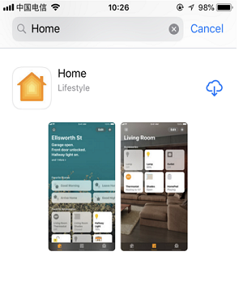
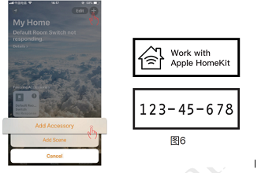
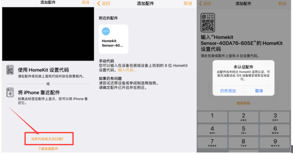

## 第一步：配置设备联网

设备上电,开启一个Homekit-sensor_xxxx的热点,连接“Homekit-sensor_xxxx”的热点，其密码为:无，大约等待3秒钟，手机将自动跳转到配网界面，
注：若有多台设备，请注意区分不同的热点名字。如果手机没有自动跳转到配网界面，请打开手机浏览器输入http://192.168.4.1，等待进入配网界面。
请在跳网面页中选择您的家庭WiFi名称，且请在password中输入密码，点击join。

## 第二步：加入到HomeKit家庭
1：检查您是否安装Home APP。
如果没有Home APP,请在App Store商城下载一个Home APP

2：请把手机连接到你的家庭WiFi网络
注意：苹果手机和设备必须是在同一个家庭WiFi网络下，即配置网络是选择的WiFi网络（例如设备配置的是连接PB9这个路由器，那么苹果手机也要连接到PB9这个路由）。

3：打开苹果手机Home APP 点击添加配件，请将图6中的设置 代码（123-45-678）放到取景框 内。选择任然添加，等待加密校验 （50s)，添加成功。

注意：如果无法识别代码，请点击“没有 代码或无法扫描”，选择刷新出来 的设备，点击仍然添加，输入设置 代码:12345678，等待加密校验 （50s），添加设备成功。
如果没有刷新到设备，请确认手机和设备是否在同一个局域网络。请确认指示灯是否在常亮状态，如果添加失败，请查看常见问题。

请点击“没有代码或无法扫描”点击刷新出来的设备，仍然添加，等待加密校验（大约30S），添加设备成功。

如果没有刷新到设备，请确认手机和设备是否在同一个局域网络。请确认指示灯是否在常亮状态，如果添加失败，请查看常见问题。
Q:配网过程中要注意哪些事项
1.配网过程中请确保设备，手机，路由器三者靠近；
2.配网过程中请确保输入的路由器的密码正确；
3.配网过程中请确保路由器工作在2.4G频段，并且使能广播功能，并且工作在 非11n only 模式；
4.配网过程中请确保路由器无线设置加密方式为WPA2-PSK类型，认证类型为AES，或者两者皆设置为自动。
5.配网过程中若路由器开启无线MAC地址过滤，请将设备移除路由器的MAC过滤列表；请确认路由器是否有防火墙功能。若有，请关闭防火墙功能后，再尝试让设备连接路由器；
6.如果是双频路由器，请将2.4G信号和5G信号分别设置不同的密码，或者关闭5G信号，请勿打开双频合一的功能；

Q:若我已经配置过了，想要重新配置该怎么办？
若以前已经配置过路由，想要重新配置新的路由器，连续开关三次以上，每次上电时间超过2S，小于10s，然后重复第一次配网的步骤即可。
