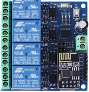
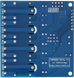
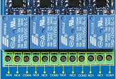

## 1. Appearance

 
 
 
 
## 2. Parameters

|Parameter                  |Description                                        |
|-----------------------|-------------------------------------------|
|Input voltage：               | 12V                 |
|Output DC voltage range：                  |28V-30V                       |
|Output DC current：           |10A                                   |
|Output AC voltage range：           |125V-250V                                      |
|Output alternating current：           |10A                                     |
|Size：           |L：60mm W：57mm  H：14mm                                      |
|Wight：             |38.5g                                      | 

## 3. Interface introduction

  
  
|Interface                   |Description                                       |
|-----------------------|-------------------------------------------|
|COM1：               |    public                       |
|NC1| Normally closed end, the relay is shorted to COM1 before the suction is closed, and it is suspended after being sucked |     
|NO1：|Normally open, the relay is suspended before it is sucked, and it is short-circuited with COM1 after suction.                                  |
|COM2：|public                                    |
|NC2：|Normally closed end, the relay is shorted to COM2 before the suction is closed, and it is suspended after being sucked                                    |
|NO2：|Normally open, the relay is suspended before it is sucked, and it is short-circuited with COM2 after suction.                                    |
|COM3：|public                                    |
|NC3：|Normally closed end, the relay is shorted to COM3 before the suction is closed, and it is suspended after being sucked                                     |
|NO3：|Normally open, the relay is suspended before it is sucked, and it is short-circuited with COM3 after suction.                                       |
|COM4：              |public                                    |
|NC4：|Normally closed end, the relay is shorted to COM4 before the suction is closed, and it is suspended after being sucked                                      |
|NO4：|Normally open, the relay is suspended before it is sucked, and it is short-circuited with COM4 after suction.                                   |
