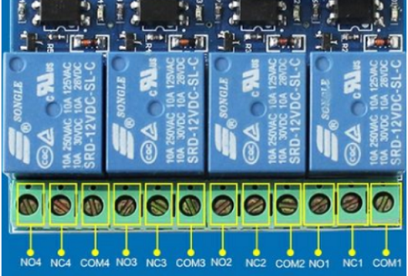

## 1. 产品外观

  
  
  

## 2. 相关参数

|参数                   |数值                                         |
|-----------------------|-------------------------------------------|
|输入电压：               | 12V                  |
|输出直流电压范围：        | 28V-30V                        |
|输出直流电流：           |10A                                   |
|输出交流电压范围：        |125V-250V                                      |
|输出交流电流：           |10A                                    |
|尺寸：                  |长：60mm 宽：57mm 高：14mm                                      |
|重量：                  |38.5g                                      |

## 3. 接口简介

  
  
|接口                   |说明                                         |
|-----------------------|-------------------------------------------|
|COM1：               |    公共端                        |
|NC1：                  | 常闭端,继电器吸合前与COM1短接,吸合后悬空                        |
|NO1：           |常开端,继电器吸合前悬空，吸合后与COM1短接                                  |
|COM2：           |公共端                                      |
|NC2：           |常闭端,继电器吸合前与COM2短接,吸合后悬空                                     |
|NO2：           |常开端,继电器吸合前悬空，吸合后与COM2短接                                    |
|COM3：             |公共端                                     |
|NC3：             |常闭端,继电器吸合前与COM3短接,吸合后悬空                                     |
|NO3：                  |常开端,继电器吸合前悬空，吸合后与COM3短接                                       |
|COM4：              |公共端                                    |
|NC4：                  |常闭端,继电器吸合前与COM4短接,吸合后悬空                                       |
|NO4：              |常开端,继电器吸合前悬空，吸合后与COM4短接                                    |
