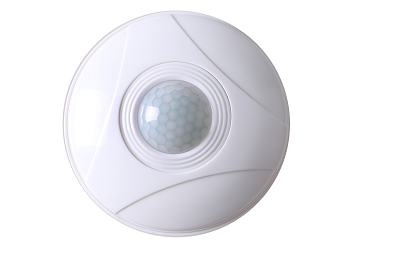

## 1.Product appearance

## 2.Related parameters
|parameter                  |Value                                        |
|-----------------------|-------------------------------------------|
|diameter：               | 10.7cm                  |
|height：        | 4.5cm                        |
|Maximum sensing distance：           |5m                                   |
|Supply voltage：        |5V                                      |

## 3.Interface description

