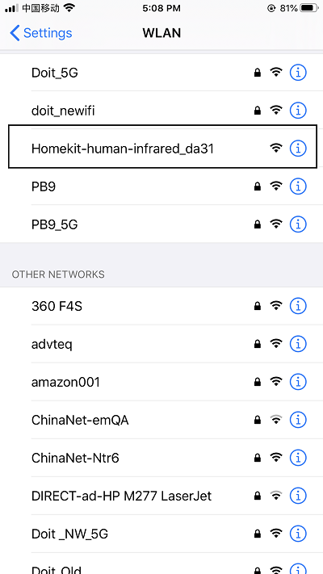
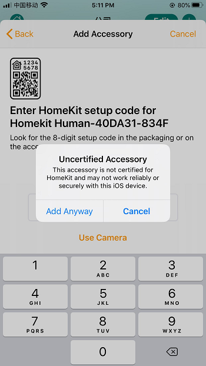
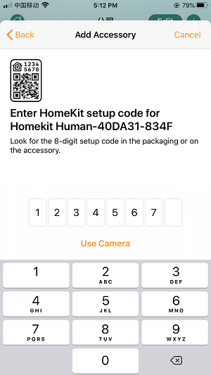
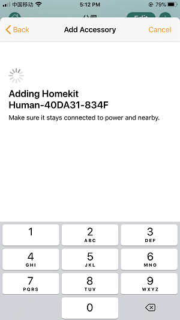
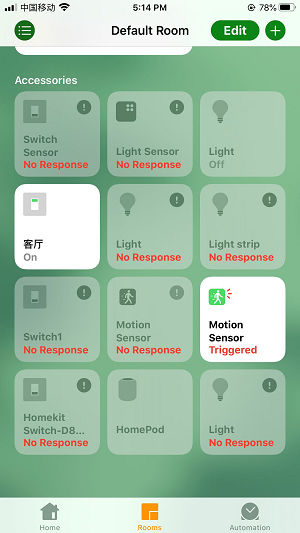

## 1.Use under Homekit

## Step 1: Configure device networking
When the device is powered on, open a hotspot of Homekit-sensor_xxxx and connect the hotspot of "Homekit-sensor_xxxx" with the password of "12345678", and wait about 3 seconds. The mobile phone will automatically jump to the distribution network interface. Note: If there are multiple devices, please pay attention to distinguishing different hotspot names.
If the mobile phone does not automatically jump to the distribution network interface, please open the mobile browser input: htt://192.168.4.1, waiting to enter the distribution network interface. Please select your family WiFi name in the jump page, and enter your password in the password, and click join.

## Step 2: Join the HomeKit family
1: Please check if you have installed Home APP.
If you don’t have Home APP, please download it in the APP store. (as picture four)

2: Connect your mobile phone to your home WiFi network
Note: Apple phones and devices must be in the same home WiFi network, that is, the configuration network is the choice of WiFi network (for example, devices are configured to connect to the PB9 router, then Apple phones should also connect to the PB9 router).

3: Open the Home App and click Add Accessories. Please click "No Code or Scan" and click on the refreshed device. Still add, wait for the encryption check (about 30S) to add the device successfully. Please rename it and enjoy it for future convenience.

## 2.How to restore factory settings
Power off the device three times (plug and unplug the device three times) in a short period of time to restore the factory settings.
## 3.Light meaning
There are two LED lights in this device. One is the power light (red). It will light up when the device is powered on, and the other is the device status indicator (blue). It is always on when the network is connected. After HomeKit is successfully added, someone triggers it. Then it will be lighted, if not, it will be off.
## 4.Precautions
Since the device is a network device, if problems such as the response of the device department occur, you can solve it according to the following methods:
If it doesn't refresh to the device, please make sure the phone and the device are in the same local area network. Please confirm whether the indicator light is on or off. If the device fails to be added, please check the FAQ.Q: What should we pay attention to in the process of distribution network
1. Make sure that equipment, mobile phone and router are close to each other in the process of distribution network.

2. Make sure the password of the router is correct in the process of distribution network.

3. Make sure that the router works in 2.4 G band and enables broadcasting, and works in non-11 n only mode.

4. In the process of network distribution, please ensure that the router wireless encryption mode is wpa2-psk type, the authentication type is AES, or both are set to automatic.

5. If the router opens wireless MAC address filtering in the process of distribution network, please remove the device from the router's MAC filter list; make sure that the router has firewall function. If yes, please turn off the firewall function and then try to connect the device to the router.

6. If it is a dual-band router, please set different passwords for 2.4G signal and 5G signal, or turn off 5G signal. Do not turn on the dual-band function.
Q: If I have already configured it, what should I do if I want to reconfigure it?

Most of the 70% to 80% of the problems can be restored to the factory settings. If not, please restore the factory settings and try again.
