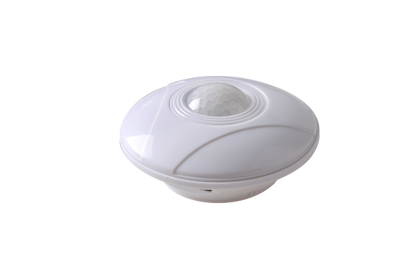
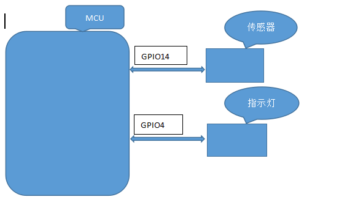

## 1.产品外观

## 2.相关参数
|参数                   |数值                                         |
|-----------------------|-------------------------------------------|
|直径：               | 10.7cm                  |
|高度：        | 4.5cm                        |
|最大感应距离：           |5m                                   |
|供电电压：        |5V                                      |

## 3.接口说明

