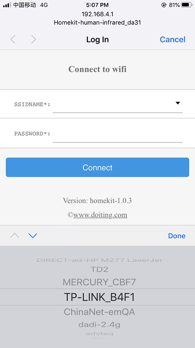
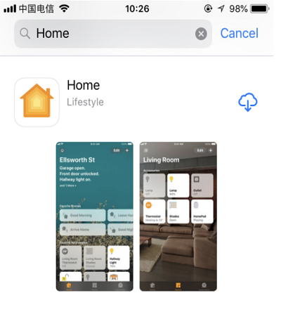
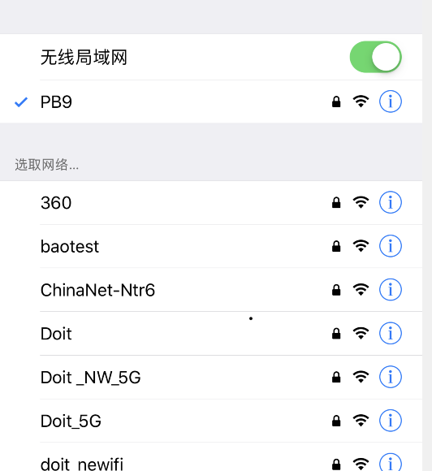
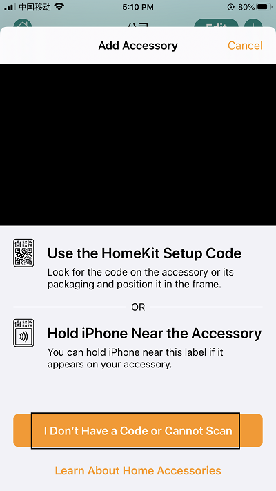
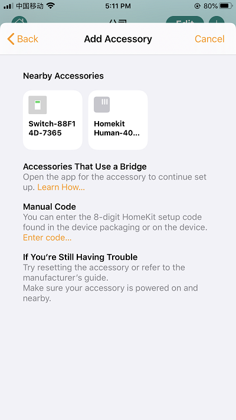

## 1.Homekit下的使用
## 第一步：配置设备联网

设备上电,开启一个Homekit-human_inrared_xxxx的热点,连接“Homekit-human_inrared_xxxx”的热点，其密码为“12345678”，大约等待3秒钟，手机将自动跳转到配网界面，注：若有多台设备，请注意区分不同的热点名字。
如果手机没有自动跳转到配网界面，请打开手机浏览器输入：htt://192.168.4.1，等待进入配网界面。请在跳网面页中选择您的家庭WiFi名称，且请在password中输入密码，点击join。

## 第二步：加入到HomeKit家庭
1：检查您是否安装Home APP。
如果没有Home APP,请在App Store商城下载一个Home APP

2：请把手机连接到你的家庭WiFi网络
注意：苹果手机和设备必须是在同一个家庭WiFi网络下，即配置网络是选择的WiFi网络（例如设备配置的是连接PB9这个路由器，那么苹果手机也要连接到PB9这个路由）。

3：打开苹果手机Home APP 点击添加配件，请点击“没有代码或无法扫描”点击刷新出来的设备，仍然添加，等待加密校验（大约30S），添加设备成功。以后方便操作请重新命名，并享受它。

## 2.如何恢复出厂设置
使设备在较短的时间内断电三次(设备插拔三次)，即可实现恢复到出厂设置。

## 3.指示灯含义
本设备共有两个LED灯一个为电源灯(红色)只要设备上电就会点亮，一个作为设备状态指示灯(蓝色)，在配网状态为常亮，设备HomeKit添加成功后，有人触发则被点亮，没有则熄灭。

## 4.注意事项
由于设备为网络设备，如果出现设备部响应等问题，可以依照如下方法进行解决：
如果没有刷新到设备，请确认手机和设备是否在同一个局域网络。请确认指示灯是处于长亮还是熄灭状态，如果设备添加失败，请查看常见问题。
Q:配网过程中要注意哪些事项
1.配网过程中请确保设备，手机，路由器三者靠近；
2.配网过程中请确保输入的路由器的密码正确；
3.配网过程中请确保路由器工作在2.4G频段，并且使能广播功能，并且工作在 非11n only 模式；
4.配网过程中请确保路由器无线设置加密方式为WPA2-PSK类型，认证类型为AES，或者两者皆设置为自动。
5.配网过程中若路由器开启无线MAC地址过滤，请将设备移除路由器的MAC过滤列表；请确认路由器是否有防火墙功能。若有，请关闭防火墙功能后，再尝试让设备连接路由器；
6.如果是双频路由器，请将2.4G信号和5G信号分别设置不同的密码，或者关闭5G信号，请勿打开双频合一的功能；

百分之七八十的问题，多是可以恢复到出厂，设置进行解决的，如果不行，请恢复到出厂设置，在试试。
