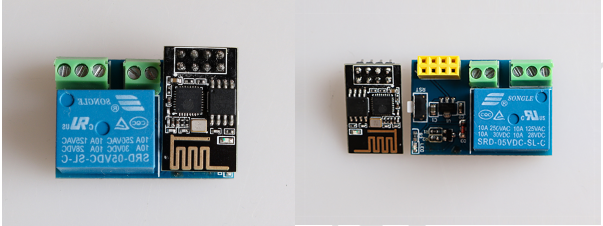
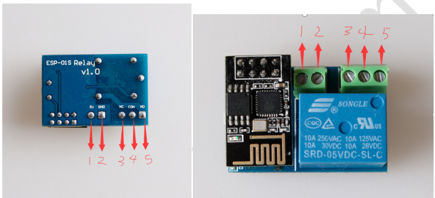

## 一、 Product appearance and its parameters

The remote control relay switch is composed of relay base plate and ESP-01S distribution network module.

   
   
|参数                   |数值                                         |
|-----------------------|-------------------------------------------|
|product name:             | HomeKit Remote Relay Switch                 |
|Product Size:                 | L:34mm  W:22mm  L:15mm                       |
|Total product weight:：           |15.5g                                 |
|Control circuit voltage:           |5V                                     |
|Control circuit current:           |150mA                                    |
|Relay output DC voltage range:           |28V-30V                                    |
|Relay output DC current:             |10A                                      |
|Relay output AC current:             |10A                                     |
|Relay output DC current range:                 |125V-250V                                      |

##  二、Remote relay switch interface description

### 1.Interface description
There are five externally controllable interfaces on the relay, from left to right, 1.5V power port, 2. GND port, 3. normally closed NC port, 4. shared CON port, 5. normally open NO port, as shown below Shown.

   
   
### 2. Introduction to use:
When the external normally opened NO port and the common CON port, the mobile phone end opens the switch, the relay is energized and closed, NO and COM are turned on, the mobile phone terminal is closed, the relay is disconnected, NO and CON are disconnected; when the external normally closed port NC and the common port CON are externally connected The opposite is true.

### 3.Button description:

  
  
When the button is turned on and off three times, the firmware will enter the HomeKit mode, and the switch will enter the DoHome mode six times.
