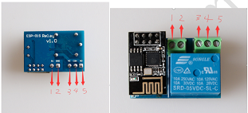
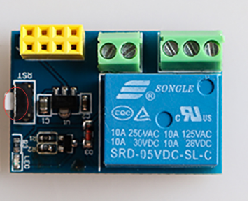

## 1.外观及参数
组成：远程遥控继电器开关由继电器底板和 ESP-01S配网模组组成
  
  
  
|参数                   |数值                                         |
|-----------------------|-------------------------------------------|
|产品名称：               | HomeKit远程遥控继电器开关                  |
|尺寸：                  | 长34mm*宽22mm*高15mm                        |
|产品总重量：             |15.5g                                   |
|控制电路电压：           |5V                                      |
|控制电路电流：           |150mA                                     |
|继电器输出直流电压范围：   |28V-30V                                      |
|继电器输出直流电流：      |10A                                      |
|继电器输出交流电流：      |10A                                      |
|继电器输出直流电流范围：   |125V-250V                                       |

## 2.远程继电器开关接口说明
### 1.接口说明

继电器上共有五个可外接进行控制的接口，从左到右依次为1.5V电源口，2.GND口，3.常闭NC口，4.共用CON口，5.常开NO口,如下图所示。

  
  
### 2.使用介绍

当外接常开NO口和公共CON口时，手机端打开开关，继电器通电闭合，NO与COM导通，手机端关闭，继电器断开，NO与CON断开;外接常闭口NC和公共口CON时则与此相反。

### 2.按键说明

  
  
当对按键进行开关三次后，固件将进入到HomeKit模式，开关六次将进入DoHome模式
