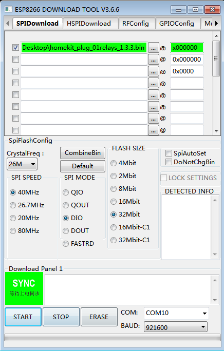

## 使用下载器下载固件说明

step1：将远程继电器上的配网模组取下，插上下载器后，使用usb数据线与你的计算机连接。
下载器的购买链接：

https://item.taobao.com/item.htm?spm=a1z10.5-c.w4002-1811579842.25.23cc4e786tXfZl&id=602394770230

step2：与pc机连接正常后，点击如下链接下载合成固件。

https://github.com/SmartArduino/DoHome/tree/master/DoHome_HomeKit_Firmware/plug_01/v1.3.3

step3:固件下载成功后，点击如下链接下载固件下载工具(工具类型选择ESP8266)。

https://www.espressif.com/zh-hans/support/download/other-tools

step4:工具和固件下载到本地成功后，芯片类型选择8266，选择合适的串口点击START按钮开始下载，其中固件的下载地址填写如下表。

| 固件              | 下载地址      |
| ----------------- | -------------| 
| homekit_plug_01relays_1.3.3.bin            | 0x0000       | 

  

