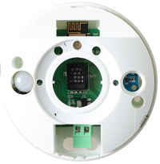

## 1. Appearance:

## 2. Product Manual:

This product has multiple built-in sensors, including human body infrared, light intensity, and temperature and humidity, which can detect the light intensity, temperature and humidity in the current indoor environment, and whether people are moving in real time and dynamically detect. At the same time, a built-in relay module can detect Externally control other advantageous equipment effectively.

## 3. parameter description：

|parameter                   |Value                                        |
|-----------------------|-------------------------------------------|
|product name：               | HomeKit温湿度+运动+光感+继电器                 |
|Size：                  |直径：6.7cm 高度：3cm                      |
|Temperature measurement range：              |-40℃-80℃                                 |
|Humidity measurement range：         |0-99.9%                                     |
|Maximum human detection distance          |5m                                     |
|Light detection accuracy：          |1 lux                                     |
|Temperature resolution：             |0.1%℃                                      |
|Humidity resolution：             |0.1%RH                                     |
|Power consumption：                  |350uA                                      |
|Product supply voltage：                       | 5V                                         |
|Relay external maximum voltage:                       |  250V                                       |
|Relay external maximum current:                       |  10A                                       |
