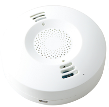

## 1. 产品外观

 

## 2. 产品说明
本款产品内置多个传感器，包括人体红外，光照度，和温湿度，可以对当前室内环境中的光照强度，温度以及湿度，以及是否有人员走动进行实时动态的检测，同时内置继电器模组，可外接对其它优点设备进行有效控制，其中外壳往逆时针旋转到对应刻度线即可拆下。
## 3. 参数说明

|参数                   |数值                                         |
|-----------------------|-------------------------------------------|
|产品名称：               | HomeKit温湿度+运动+光感+继电器                 |
|尺寸：                  |直径：6.7cm 高度：3cm                      |
|温度测量范围：              |-40℃-80℃                                 |
|湿度测量范围：          |0-99.9%                                     |
|人体检测最大距离：           |5m                                     |
|光照检测精度：           |1 lux                                     |
|温度分辨率：             |0.1%℃                                      |
|湿度分辨率：             |0.1%RH                                     |
|功耗：                  |350uA                                      |
|产品供电电压：                       | 5V                                         |
|继电器外接最大电压                         |  250V                                       |
|继电器外接最大电流                         |  10A                                       |
