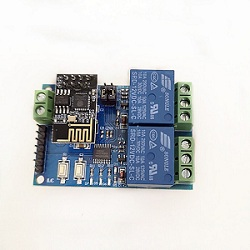

## 1. Appearance

 
 
 
## 2. Parameters

|Parameter                  |Description                                        |
|-----------------------|-------------------------------------------|
|Input voltage：               | 12V                 |
|Output DC voltage range：                  |28V-30V                       |
|Output DC current：           |10A                                   |
|Output AC voltage range：           |125V-250V                                      |
|Output alternating current：           |10A                                     |
