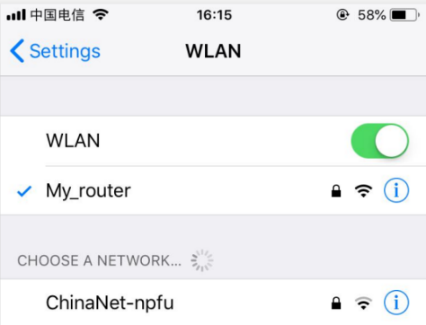

## 1. How TO Use

The default mode of the device is homekit.
HomeKit (ONLY for Apple users):
Step 1: Please open the WLAN setting page of your iPhone (as Fig. 1), find and connect the WiFi hotspot named as Homekit_xxxx. After about 3s, WiFi configuration interface will pop up automatically.
Note: If the interface doesn’t pop up automatically, please open your phone browser and input http://192.168.4.1. And then, please wait for entering the interface of configuration.

 
 
 Fig.1 Connect your iPhone or iPad to the new wifi network Homekit_xxxx hotspot
Step 2: Wait for the Captive Portal and select your WiFi network in the pop-up window, and insert your password and click “join” (as Fig. 2). Please make sure that the indicator always lights (the WiFi account information in the pictures is only for reference).
Note: If you don't find your router or smart plug at other states. Please look over the Frequent Problems and reconfigure the smart socket.

  

Fig. 2 Wait for the Captive Portal and select your WiFi network

Step 3: Please check if you have installed Home APP.
If not, please download it in the App Store. (as Fig. 3). If it is already installed, go to step 4.

  
  
Fig. 3 Download the Home App
Step 4: Please connect your phone with your home WiFi network (as Fig. 4)
Note: Please ensure that the IPhone and the smart plug are in the same network.

  
  
Fig. 4 Connect your phone with your home WiFi network
Step 5: 
1)Open the Home app
 2)Click the + symbol
 3)Click I don't have the code..
 4) Select the Switch-xxx. When the Switch-xxx does not appear on top of the page, if you have a dual-band router, please turn off the 5GHZ Wi-Fi network and ensure that yu are using 2.4GHz Wi-Fi network.
 5)Confirm that you want to add the device
 6)Insert the Password that is 12345678
 7) After waiting for the encryption check (about 30s-50s), you have added the switch successfully. Please rename the smart device for convenient operation in the later, and enjoy it.
 
  
  Fig. 4 How to Pair HomeKit
  
## 2. Frequent Problems:
Q1: How to reset the socket to the factory mode?
A: Switch three times (power off three times) can be restored to factory mode.
