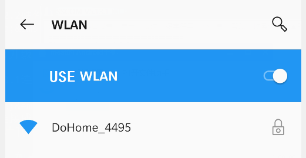
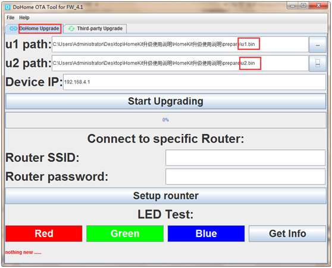
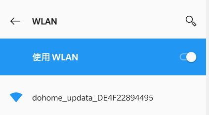
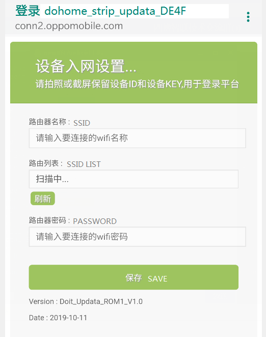
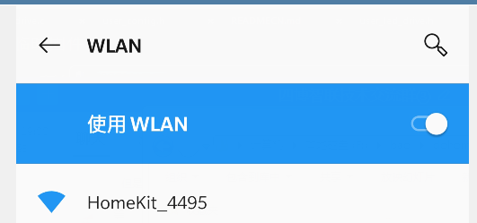

<a href="https://github.com/SmartArduino/DoHome/blob/master/Upgrade_DoHome_IoT_devices/README.md">English</a> | 中文版

# Dohome灯带升级到Homekit固件

## 1.简介

&emsp;把Dohome灯带升级到含有homekit功能的固件，因为dohome固件基于NONOS SDK开发，homekit基于ESP-OPEN-RTOS SDK开发，两者SDK
不同，BootLoader引导文件不同，不能直接升级，dohome固件需要先下载中间临时固件烧录ESP-OPEN-RTOS的boot才能运行homekit固件

## 2.需要的软件和工具

### 2.1软件
升级工具：

&emsp;&emsp;下载连接：http://support.doiting.com/DoHome.zip

&emsp;&emsp;如果你的电脑是32位系统则下载DoHome_JRE_32.zip；64位系统则下载DoHome_JRE_64.zip

中间临时固件：
  
### 2.2硬件 
&emsp;&emsp;dohome灯带控制器

## 3.升级步骤

### 3.1连接Dohome_xxxx热点

&emsp;&emsp;给灯带控制器上电，连接模块建立热点 `Dohome_xxxx` （xxxx为id），密码：`12345678` ，连接成功进入下一步。

注意：如果灯带控制器已经配置过wifi，连续插拔三次电源恢复出厂，模块建立热点。

### 3.2升级到临时固件

&emsp;&emsp;打开电脑上的升级工具 `DoHome_v212.exe` 进入 `DoHome upgrade` 界面，在`u1 path` ，`u2 path`填入对应的 `mid_u1.bin` 
和 `mid_u2.bin` 临时固件; `Device IP` 填入：`192.168.4.1`

其他区域不用填写。点击Start upgrading即可开始升级。

### 3.3升级完成
&emsp;&emsp;等待进度条走到100%，提示升级完成；模块将会重启，建立热点，`dohome_updata_XXXXXXXXXXXX`,

连接这个热点，用浏览器访问 `http://192.168.4.1`,然后输入家里的wifi名称和密码，

灯带控制器连接这个热点后会从服务器下载最新的homekit灯带固件和boot引导

这个过程中灯带会灭和闪烁之前切换。等到灯带颜色变成红-》绿-》蓝-》白,白色常亮后即升级到homekit固件，这时可以看到热点Homekit_xxxx

